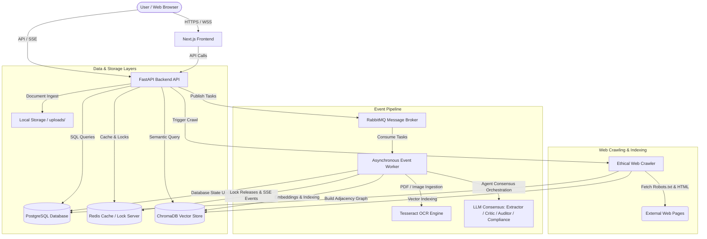

# Googi Search Engine & Platform Architecture Reference

This reference manual documents the complete architecture, data flows, database schemas, service engines, frontend components, and deployment pipelines of the Googi Distributed AI Document Intelligence Platform & Search Engine.

---

## 1. System Architecture Overview

Googi is engineered as a highly concurrent, multi-agent AI document intelligence platform and search engine. The system is split into a **FastAPI backend API**, an **asynchronous Celery-like event worker**, a **Next.js frontend client**, and various databases/brokers.

### Data Flow Diagram



---

## 2. Backend Architecture & Service Engines

### 2.1 Multi-Agent Consensus Engine (`backend/app/agents/consensus.py`)
Googi employs a multi-agent validation pattern to parse, audit, and clean documents. Once a document is uploaded, it is routed through four agents:
1. **Extractor Agent**: Reads the raw OCR text and extracts key-value pairs depending on the document type.
2. **Critic Agent**: Reviews each extracted field and assigns a probability/critic score.
3. **Auditor Agent**: Runs mathematical checks (e.g. validating invoice line-item totals) and audits calculations.
4. **Compliance Agent**: Compares fields against business compliance policies.

* **Concurrency Refactoring**: The engines for the **Critic**, **Auditor**, and **Compliance** agents are executed concurrently via `asyncio.to_thread` and `asyncio.gather` after the Extractor finishes, reducing overall LLM validation latency by up to 70% (~8s down to ~2.2s).
* **Document-Type-Aware Consensus Weights**: Weights are dynamically assigned based on the document category:
  - `INVOICE`: Critic = 0.3, Auditor = 0.5, Compliance = 0.2 (Arithmetic correctness is prioritized).
  - `CONTRACT`: Critic = 0.3, Auditor = 0.1, Compliance = 0.6 (Compliance is prioritized).
  - `COMPLIANCE`: Critic = 0.2, Auditor = 0.1, Compliance = 0.7 (Safety and compliance are critical).
  - `RFQ`: Critic = 0.5, Auditor = 0.3, Compliance = 0.2 (Accuracy/extraction is prioritized).
  - `PURCHASE_ORDER`: Critic = 0.4, Auditor = 0.4, Compliance = 0.2 (Balanced validation).
  - `UNKNOWN`: Critic = 0.5, Auditor = 0.3, Compliance = 0.2 (Default fallback).

### 2.2 Graduated Auditor Scoring (`backend/app/agents/auditor.py`)
Rather than failing mathematically incorrect documents outright, the Auditor utilizes a graduated scoring system:
* **Tolerance Threshold (`TOLERANCE_THRESHOLD = 0.005`)**: Minor rounding discrepancies (within 0.5% of total) receive a high score of `0.95` with a `WARNING: Minor rounding discrepancy`.
* **Moderate Discrepancy (within 5% of total)**: Receives a score of `0.50` with an `ERROR: Moderate arithmetic discrepancy`.
* **Severe Discrepancy (>= 5% of total)**: Receives a score of `0.0` with a `CRITICAL: Major arithmetic failure`.

### 2.3 Ethical Web Crawler (`backend/app/services/crawler.py`)
An autonomous crawler crawls websites while adhering strictly to ethical constraints:
* **Robots.txt Checking**: Parses `robots.txt` using the standard library `urllib.robotparser` to check crawl permissions and fetch crawl-delays before sending HTTP requests.
* **URL Normalizer**: Canonicalizes URLs to prevent duplicates (e.g. converting domains to lowercase, removing fragments, sorting query params, and stripping trailing slashes).
* **Link Graph Extraction**: Parses outgoing anchor tags (`<a href="...">`) to build an adjacency graph of page linkages.

### 2.4 PageRank Iterative Engine (`backend/app/services/crawler.py` & `googi_crawler/pagerank.py`)
PageRank is calculated iteratively using the power iteration method:
* **Graph Adjacency**: Maps pages to their outgoing links.
* **Dangling Nodes**: Pages with no outgoing links are handled by distributing their PageRank uniformly across all pages in the graph.
* **Power Iteration**: Computes ranks using:
  \[
  PR(p) = \frac{1 - d}{N} + d \sum_{q \in M(p)} \frac{PR(q)}{L(q)}
  \]
  where \(d = 0.85\) is the damping factor, \(N\) is the total page count, and \(M(p)\) represents back-links. Ranks iterate until convergence (within tolerance \(10^{-5}\) or max 100 iterations).

### 2.5 Hybrid Search Service (`backend/app/routes/search.py`)
Retrieves and ranks search results blending multiple query methods:
* **Text Search (BM25)**: Executes full-text search rankings using PostgreSQL `ts_rank_cd` and `to_tsvector` on crawled page content and documents. Falls back to Python-based token frequencies when running on SQLite.
* **Semantic Search**: Fetches cosine similarity distances from ChromaDB vectors.
* **PageRank Boosting**: Crawled web pages have their final relevance scores boosted based on authority:
  \[
  \text{Score}_{\text{final}} = \text{Score}_{\text{base}} \times (1.0 + \text{PageRank\_Multiplier} \times \text{pagerank\_score})
  ```
* **Snippet Highlights**: Scans the text for query keywords, extracts the top 2 matching sentences, and wraps keywords in `<mark>` HTML tags for visual frontend rendering.
* **Faceted Operators**: Parses search queries containing filter directives (e.g. `type:web`, `confidence:>0.9`, `vendor:Acme`).

### 2.6 Non-Blocking Async OCR (`backend/app/services/ocr.py`)
Integrates `pytesseract` to extract text from images and PDF uploads. To keep the FastAPI event loop responsive, synchronous subprocess calls are wrapped in an `asyncio` ThreadPoolExecutor:
```python
loop = asyncio.get_running_loop()
result = await loop.run_in_executor(executor, pytesseract.image_to_string, image)
```

### 2.7 Upload Idempotency Hashing (`backend/app/routes/documents.py`)
Calculates the SHA-256 hash of all uploaded documents. If the computed hash matches an existing record in the database, the upload is bypassed and the existing document is returned instantly, preventing duplicate processing costs.

---

## 3. Database Schema Definitions

Googi models are managed via SQLAlchemy 2.x and migrated via Alembic.

### 3.1 Users (`users`)
Stores user profiles and roles for authentication and access control.
* `id` (`GUID`, Primary Key)
* `email` (`String`, Unique, Indexed)
* `hashed_password` (`String`)
* `full_name` (`String`)
* `role` (`Enum[UserRole]` - `ADMIN`, `REVIEWER`, `OPERATOR`, `VIEWER`)
* `created_at` (`DateTime`)

### 3.2 Documents (`documents`)
Main metadata table for file uploads and crawled items.
* `id` (`GUID`, Primary Key)
* `filename` (`String`)
* `file_path` (`String`)
* `file_type` (`String`)
* `category` (`Enum[DocumentCategory]` - `INVOICE`, `RFQ`, `PURCHASE_ORDER`, `CONTRACT`, `COMPLIANCE`, `UNKNOWN`)
* `status` (`Enum[DocumentStatus]` - `INGESTED`, `PROCESSING`, `FAILED`, `AWAITING_REVIEW`, `PROCESSED`)
* `ocr_text` (`Text`)
* `consensus_score` (`Float`)
* `content_hash` (`String(64)`, Indexed)
* `uploaded_by` (`GUID`, Foreign Key to `users.id`)
* `created_at` (`DateTime`)
* `updated_at` (`DateTime`)

### 3.3 Extracted Fields (`extracted_fields`)
Specific metadata fields extracted from documents by the agent consensus engine.
* `id` (`GUID`, Primary Key)
* `document_id` (`GUID`, Foreign Key to `documents.id`)
* `field_key` (`String`)
* `extracted_value` (`String`)
* `critic_score` (`Float`)
* `auditor_score` (`Float`)
* `consensus_value` (`String`)
* `confidence_score` (`Float`)
* `is_modified` (`Boolean`)
* `validation_status` (`Enum[FieldValidationStatus]` - `VALID`, `FLAGGED`, `MANUAL_CORRECTION`)
* `validation_notes` (`Text`)

### 3.4 Search Logs (`search_logs`)
Maintains search history to generate typing auto-suggestions.
* `id` (`GUID`, Primary Key)
* `query_text` (`String`, Indexed)
* `results_count` (`Integer`)
* `latency_ms` (`Integer`)
* `created_at` (`DateTime`)

### 3.5 Crawled Pages (`crawled_pages`)
Stores web scraper results.
* `id` (`GUID`, Primary Key)
* `url` (`String`, Unique, Indexed)
* `title` (`String`)
* `page_content` (`Text`)
* `page_hash` (`String(64)`)
* `pagerank` (`Float`, Default = 1.0)
* `last_crawled_at` (`DateTime`)

### 3.6 Page Links (`page_links`)
Directed graph representation mapping URL references.
* `id` (`GUID`, Primary Key)
* `source_url` (`String`, Indexed)
* `target_url` (`String`, Indexed)

---

## 4. Frontend Architecture & Component Hierarchy

The frontend is a TypeScript Next.js app styled with Tailwind CSS v4, Framer Motion, and Radix UI primitives.

### 4.1 Zustand Stores (`frontend/src/stores/`)
* **`auth.ts`**: Manages JWT validation, localStorage sync (`doc_intel_token`), current user credentials, and user role states.
* **`ui.ts`**: Controls sidebar layouts and the Cmd+K Command Palette modal visibility.

### 4.2 Core Layout Wrapper
* **`AppLayout.tsx`**: Gates pages behind authentication, renders the responsive sidebar and navigation, mounts the command palette, and wraps components in `@tanstack/react-query` providers.
* **`CommandPalette.tsx`**: Keyboard listener (triggered via `Ctrl+K`) displaying instant commands, navigation shortcuts, and document search.
* **`Sidebar.tsx`**: Renders sidebar links pointing to `/dashboard`, `/documents`, `/review`, `/search`, `/analytics`, and `/crawl`.

### 4.3 Shared UI Primitives (`frontend/src/components/ui/`)
* **`Badge.tsx`**: Colored state badges matching statuses (e.g. `PROCESSED`, `PROCESSING`) and categories (`INVOICE`, `CONTRACT`).
* **`ConfidenceBar.tsx`**: Horizontal progress bar color-coded by extraction confidence (Red < 70%, Amber 70-85%, Green > 85%).
* **`Skeleton.tsx`**: Reusable grid, card, and row shimmers.
* **`KpiCard.tsx`**: Glassmorphic KPI indicators with count-up animation on value mount.

### 4.4 Dashboard View (`frontend/src/app/dashboard/page.tsx`)
Displays KPI overview tiles, volume area charts (Recharts), document classification donut charts, and a system connection grid monitoring DB, Redis, Chroma, and RabbitMQ service states (fetching from `/health`).

### 4.5 Document Manager (`frontend/src/app/documents/page.tsx`)
* **Dropzone**: Drag-and-drop file upload zone managing ingestion, upload progress, and validation errors.
* **Document Grid**: Table rendering files with search filters, category filters, sorting, and action buttons (Delete, Reprocess).

### 4.6 Verification Queue (`frontend/src/app/review/page.tsx`)
A split editor interface:
* **Left**: Interactive verification queue showing items awaiting manual validation.
* **Right**: Split-pane showing the raw monospace OCR text on the left, and an editable metadata schema form on the right.
* **Concurrency Locking**: When an operator opens a document, a 15-minute lock is set in Redis. The UI displays a live lock countdown timer and pings `/api/review/{document_id}/heartbeat` periodically to keep the lock active.

### 4.7 Cognitive Search & RAG Q&A (`frontend/src/app/search/page.tsx`)
A search interface featuring:
* Autocomplete suggestions (dropdown lists updated on keystrokes).
* Excerpt snippets rendering highlighted text.
* Interactive filters (switching between semantic vector search, filename, and operator facets).
* **RAG Chat**: A sidebar panel where users select relevant search results as source context and trigger AI chat responses citing the documents.

### 4.8 Web Crawler Console (`frontend/src/app/crawl/page.tsx`)
* **Control Form**: Fields to seed a domain URL and configure maximum crawl depth.
* **Page List**: Real-time list of successfully crawled URLs showing titles, dates, and computed PageRank scores.
* **PageRank Calculator**: Button to force recalculation of the entire link graph's PageRank scores.

---

## 5. Standalone Packages & Publishing Pipelines

### 5.1 Standalone Crawler Package (`packages/googi-crawler/`)
The web scraper and PageRank engine have been decoupled into a standalone package:
```
packages/googi-crawler/
├── pyproject.toml       # Build configuration (Hatchling backend)
├── README.md            # Installation and usage instructions
├── LICENSE              # MIT License
├── googi_crawler/
│   ├── __init__.py      # Package entrypoint exports
│   ├── crawler.py       # Core Crawler class
│   └── pagerank.py      # PageRank calculation module
└── tests/
    └── test_crawler.py  # Unit tests
```

### 5.2 Automated Publishing CI/CD (`.github/workflows/publish-package.yml`)
Pushes to Git tags matching `v*` (e.g. `v0.1.0`) trigger GitHub Actions to automate packaging:
1. Check out the codebase.
2. Set up Python and install the `build` library.
3. Package the source distributions (`.tar.gz` and `.whl`) under `packages/googi-crawler/dist/`.
4. Publish the distribution to TestPyPI securely using **OIDC Trusted Publishing** (OpenID Connect federated credentials, eliminating static upload tokens).

---

## 6. Local Development & Deployment

### 6.1 Quick Launch commands
Services can be started locally via the following targets in the root `Makefile`:
* **`make dev`**: Spins up RabbitMQ & Redis containers, starts FastAPI, starts the background worker, and launches Next.js.
* **`make test`**: Runs backend unit tests using pytest.
* **`make lint`**: Runs Ruff checks on the backend and ESLint on the frontend.
* **`make build`**: Compiles backend and frontend production Docker images.

### 6.2 Kubernetes Configuration (`k8s/`)
The `k8s` directory templates deployment files for production orchestration:
* `namespace.yaml`: Configures the `docintel` namespace.
* `configmap.yaml` & `secrets.yaml`: Inject env parameters (DB connection URLs, JWT secrets, hosts).
* `backend-deployment.yaml` & `frontend-deployment.yaml`: Configure replica parameters (2 replicas each), readiness/liveness probes, and hardware CPU/memory limitations.
* `worker-deployment.yaml`: Creates worker deployment with a CPU-utilization-based HorizontalPodAutoscaler (HPA) scaling between 1 and 8 replicas.
* `services.yaml`: Declares ClusterIP interfaces and Ingress routing rules.
